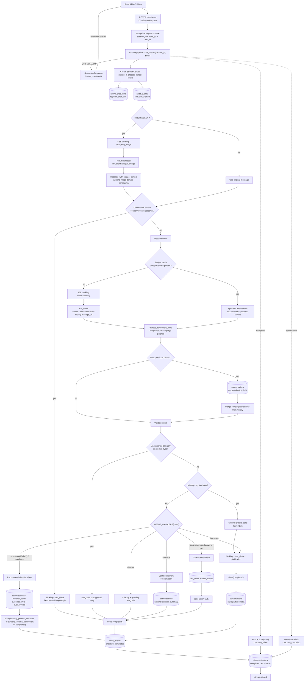
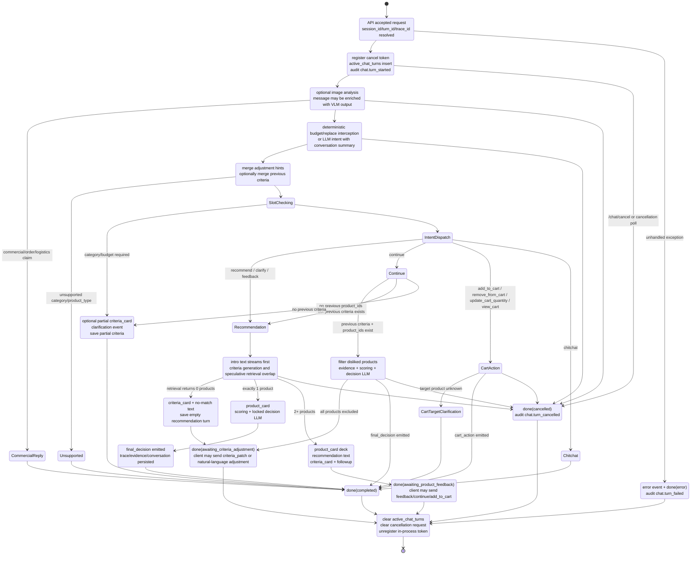

# /chat/stream DataFlow 与 State Machine

本文档梳理当前后端 `POST /chat/stream` 的全链路数据流与状态机。代码入口和主要实现：

- API 边界：`backend/src/api/chat.py`
- 主编排：`backend/src/runtime/pipeline.py`
- intent handler：`backend/src/runtime/handlers.py`
- stage wrapper：`backend/src/runtime/stages/`
- SSE 契约：`backend/src/types/sse_events.py`
- 主要持久化：`conversations`、`feedbacks`、`cart_items`、`retrieval_traces`、`evidence_links`、`active_chat_turns`、`chat_turn_cancellations`、`audit_events`

## 关键数据对象

| 对象 | 生命周期 | 主要字段/作用 |
| --- | --- | --- |
| `ChatStreamRequest` | HTTP request 输入 | `message/session_id/history/image_url/criteria_patch/client_turn_id/client_trace_id` |
| `StreamContext` | 单次 stream turn 内部上下文 | `session_id/turn_id/deck_id/EventSeq/cancel_token/stage_timings_ms/background_tasks` |
| `IntentResult` | 意图阶段输出 | `intent/category/extracted_constraints/target_product_id`，驱动 handler 分发 |
| `CriteriaPayload` | 购买标准状态 | `category/summary/chips/constraints/field_sources`，会保存到 `conversations.criteria_json` |
| `RetrievalResult` | 检索阶段输出 | `products/evidence_by_product/trace_details`，用于卡片、trace、evidence link |
| SSE events | 对客户端输出 | `thinking/text_delta/criteria_card/product_card/final_decision/cart_action/clarification/error/done` |

## DataFlow 总览

## 推荐分支 DataFlow

`recommend`、`clarify`、`feedback` 三类 intent 都进入 `handle_recommendation`。其中 `feedback` 会先写入反馈，再按新反馈重跑推荐。

```mermaid
flowchart TD
    Start["handle_recommendation"] --> FeedbackIntent{"intent == feedback ?"}
    FeedbackIntent -->|yes| RecordFeedback[("feedbacks<br/>record_feedback + audit")]
    FeedbackIntent -->|no| ParallelReads
    RecordFeedback --> ParallelReads

    ParallelReads["Start DB reads in background<br/>get_feedback_context<br/>get_previous_product_ids if replace deck"] --> SpecCriteria["criteria_from_intent<br/>build speculative criteria"]
    SpecCriteria --> Intro["stream intro text_delta<br/>while DB reads run"]
    Intro --> FeedbackReady["await feedback_task<br/>merge previous product ids into avoid_products when replace deck"]

    FeedbackReady --> SpecRetrieval["Start speculative retrieval background<br/>top_n=8"]
    FeedbackReady --> CriteriaStage["run_criteria in foreground<br/>previous criteria + feedback + conversation summary<br/>or apply criteria_patch"]

    SpecRetrieval --> Embed["embed_text(criteria_query_text)"]
    Embed --> PGVector[("product_chunks JOIN products<br/>pgvector similarity<br/>SQL downpush category/budget/product_type/brand_avoid/avoid_product_ids")]
    PGVector --> HardFilter["Python hard filters<br/>category/budget/brand/origin/product_type/avoid_traits"]
    HardFilter --> Rank["filter score + vector score"]
    Rank --> Rerank["rerank_texts"]
    Rerank --> Evidence["select evidence chunks<br/>why_buy/faq/risk/compare priority"]
    Evidence --> SpecResult["RetrievalResult"]

    CriteriaStage --> FullCriteria["CriteriaPayload"]
    SpecResult --> PostFilter["post-filter speculative result<br/>against full CriteriaPayload"]
    FullCriteria --> PostFilter
    PostFilter --> ContinueReco{"usable products?"}
    ContinueReco -->|no or spec failed| SerialRetrieval["run_retrieval(full criteria)<br/>same retrieval path"]
    ContinueReco -->|yes| Branch
    SerialRetrieval --> Branch{"product count"}

    Branch -->|0| NoMatch["criteria_card + no-match text_delta<br/>save conversation with []"]
    NoMatch --> DoneAdjust["done(awaiting_criteria_adjustment)"]

    Branch -->|1| Single["product_card<br/>score_candidates + decision_confidence"]
    Single --> SingleDecision["run_decision locked to scoring winner"]
    SingleDecision --> FinalSingle["criteria_card + final_decision"]
    FinalSingle --> PersistSingle[("save conversation<br/>record retrieval_trace<br/>record evidence_links")]
    PersistSingle --> DoneComplete["done(completed)"]

    Branch -->|2+| Multi["product_card deck<br/>with reason_atoms + evidence"]
    Multi --> RecoText["stream_recommendation_text<br/>text_delta chunks"]
    RecoText --> CriteriaCard["criteria_card<br/>quick_actions"]
    CriteriaCard --> Followup["followup text_delta<br/>default/subsequent/budget-relaxed"]
    Followup --> PersistMulti[("save conversation<br/>record retrieval_trace<br/>record evidence_links")]
    PersistMulti --> DoneFeedback["done(awaiting_product_feedback, deck_id)"]
```

## State Machine

## SSE 事件顺序速查

| 分支 | 典型事件顺序 |
| --- | --- |
| 图片输入 | `thinking(analyzing_image)` -> 后续正常链路 |
| 普通推荐，多商品 | `thinking(understanding)` -> intro `text_delta*` -> `thinking(criteria/searching)*` -> `product_card*` -> recommendation `text_delta*` -> `criteria_card` -> followup `text_delta*` -> `done(awaiting_product_feedback)` |
| 普通推荐，单商品 | intro `text_delta*` -> `thinking(criteria/searching)*` -> `product_card` -> `criteria_card` -> `thinking(decision)` -> `final_decision` -> `done(completed)` |
| 无匹配商品 | intro `text_delta*` -> `thinking(criteria/searching)*` -> `criteria_card` -> no-match `text_delta*` -> `done(awaiting_criteria_adjustment)` |
| 槽位澄清 | optional `criteria_card` -> `thinking(clarifying)` -> clarification analysis `text_delta*` -> `clarification` -> `done(completed)` |
| 继续当前 deck | `thinking(decision)` -> `final_decision` -> `done(completed)`，若全部被反馈排除则 `final_decision(no_suitable_winner)` -> `criteria_card` -> `done(awaiting_criteria_adjustment)` |
| 购物车 | optional `clarification` when target unknown；否则 `cart_action` -> `done(completed)` |
| 闲聊 | `thinking(understanding)` -> greeting `text_delta(done=true)` -> `done(completed)` |
| 取消 | 任意 heartbeat/cancel check 点 -> `done(cancelled)` |
| 异常 | `error` -> `done(error)` |

## 状态持久化点

| 时机 | 写入 |
| --- | --- |
| turn 开始 | `active_chat_turns`、`audit_events(chat.turn_started)` |
| 槽位澄清 | `conversations` 保存 partial criteria 和空商品列表 |
| 推荐完成 | `conversations` 保存 criteria、deck_id、product_ids、user_message |
| 推荐完成 | `retrieval_traces` 保存 filters、vector_top_k、rerank_top_n、selected_ids、stage timings、fallbacks |
| 推荐完成 | `evidence_links` 保存 product 与 evidence/chunk 的绑定 |
| feedback intent | `feedbacks`、`audit_events(feedback.created)` |
| cart intent | `cart_items`、`audit_events(cart.*)` |
| turn 结束/取消/异常 | `audit_events(chat.turn_completed/cancelled/failed)`；清理 `active_chat_turns` 和 cancellation request |

## 关键实现特征

- `/chat/stream` 不直接操作 LLM 或数据库，核心委托给 `runtime.pipeline.chat_stream`。
- `run_with_heartbeat` 会在长耗时 stage 中周期性发 `thinking`，并轮询持久化取消请求。
- 推荐路径做了“先说话、并行查库、speculative retrieval、criteria 完整生成后 post-filter”的低延迟设计。
- 检索链路以数据库 chunk 为准：embedding query -> pgvector SQL 过滤下推 -> Python hard filter 二次防线 -> rank -> rerank -> evidence binding。
- 多商品推荐不会直接给最终 winner，而是进入 `awaiting_product_feedback`，等待用户反馈或继续收敛；单商品或继续当前 deck 才会输出 `final_decision`。
- `done.finish_reason` 是客户端状态切换的主要信号；`deck_id` 用于后续 feedback、continue、cart target 解析。
