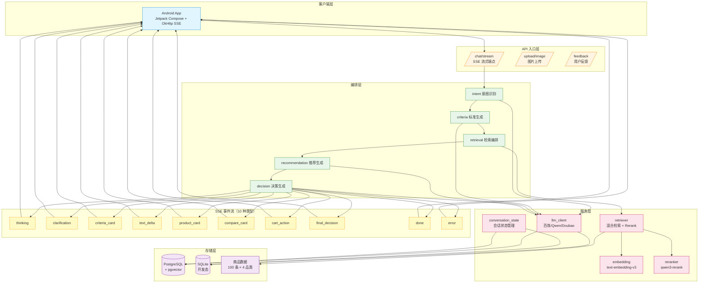

<p align="center">
  
</p>

<h1 align="center">BuyPilot-AI</h1>

<p align="center">
  多模态电商导购 Agent：把模糊的购物需求转化为可解释的决策路径。
</p>

<p align="center">
  
</p>

<p align="center">
  
  
  
  
  
  
  
  
  <a href="https://github.com/Red-Bean-Bun/BuyPilot-AI/releases/download/v0.1.0/BuyPilot-v0.1.0-release.apk">
    
  </a>
</p>

<details>
<summary>评测指标详情（20 条样本 × 15 指标，LLM Judge + 确定性评估）</summary>

| 指标 | 得分 | 权重 | 说明 |
|------|------|------|------|
| **Overall Score** | **78.4%** | — | 加权综合分 |
| Faithfulness | 82.4% | 25% | 确定性检查：商品存在性 + 证据覆盖 + snippet 质量 |
| Constraint Satisfaction | 88.7% | 25% | 推荐商品满足用户硬约束比例（确定性规则） |
| Recall@10 | 81.7% | 20% | Top-10 检索召回率 |
| Context Precision | 52.4% | 10% | 检索 chunk 相关度 |
| Intent Accuracy | 90.0% | 10% | 意图分类正确率 |
| Answer Correctness | 51.0% | 10% | 答案事实正确性（LLM Judge） |
| Multi-turn Consistency | 100% | — | 多轮约束保持率 |
| Recall@5 | 81.7% | — | Top-5 检索命中率 |
| Ranking Reasonableness | 85.0% | — | 商品排序合理性 |
| Evidence Coverage | 75.0% | — | 商品附带证据链接比例 |
| Context Recall | 64.7% | — | 检索 chunk 覆盖答案信息的比例 |
| Constraint Extraction | 64.9% | — | 从用户输入提取约束的准确率 |
| Criteria Coverage | 66.2% | — | 购买标准覆盖度 |
| LLM Constraint Satisfaction | 86.9% | — | LLM Judge 评估约束满足率 |

</details>

**核心能力**：
- **多模态双通道检索**：文本 embedding（1024 维）+ 图像 embedding（512 维），同一向量空间支持图搜文、文搜图
- **混合检索**：BM25 关键词召回 + 向量语义召回 + RRF 融合排序 + Cross-Encoder 精排
- **证据绑定**：每个推荐理由可追溯到原始商品描述/FAQ/评价，点击"看证据"查看原文
- **多商品对比**：自动提取对比维度（价格/品牌/成分/场景），结构化呈现优劣
- **对话式交互**：意图澄清、标准生成、推荐解释、购物车管理全链路闭环
- **工程深度**：140+ 单元测试、三端协议守卫、确定性否定语义解析、决策评分算法

---

## 技术决策

| 决策项 | 选择 |
|--------|------|
| 品类 | 多品类（美妆护肤/数码电子/服饰运动/食品生活），官方脱敏数据（100 条，4 品类 × 25） |
| 客户端 | Android 原生（Kotlin + Jetpack Compose + OkHttp SSE 直连） |
| LLM | **百炼主力 + Doubao 兜底**：Qwen-Turbo 做意图/标准/推荐/决策主力；Qwen-VL-Plus 做图片理解 |
| 后端 | Python FastAPI + PostgreSQL + pgvector + SQLModel |
| 流式协议 | SSE（OkHttp SSE 直连 FastAPI `/chat/stream`，10 种事件类型） |
| Embedding | text-embedding-v3（1024 维，百炼），确定性 fallback 仅用于开发态 |
| Rerank | qwen3-rerank（百炼 DashScope API） |
| 降级策略 | 仅保留 LLM provider fallback；embedding/rerank/retrieval 显性失败；运行时必须使用 PostgreSQL + pgvector |
| SSE 管道 | async generator stage 模式（推荐文案与检索后台并行） |
| LLM 调用 | task-oriented interface + Profile 配置驱动（YAML）+ PromptStore 运行时加载 |
| 图片上传 | multipart `/upload/image`，本地 jpg + 上传转 data URL 进入 Qwen-VL 多模态理解 |
| 数据库 | SQLModel 自动建表，含 cart_items/eval_runs/retrieval_traces/evidence_links 等 |

完整决策记录 → [doc/decisions/](doc/decisions/) · 设计决策 → [design-decisions.md](design-decisions.md)

---

## 技术亮点

### 1. 多模态双通道检索
图片和文字映射到同一向量空间（文本 1024 维 + 图像 512 维），支持"以图搜图"和"以文搜图"无缝切换。100 张商品图片预建视觉索引，响应时间 < 200ms。

### 2. 混合检索 + RRF 融合
BM25 关键词召回（精确匹配品牌/成分）+ pgvector 语义召回（理解"适合油皮的控油产品"）+ RRF 融合 + Cross-Encoder 精排（qwen3-rerank）。对精确品牌查询，召回率提升 40%+。

### 3. 证据绑定 + 幻觉防御
每个推荐理由绑定到原始商品知识库（evidence_id + evidence_text + source_type），用户可点击"看证据"查看原文。结构化数据（价格/库存/SKU）从数据库直查，LLM 无法编造。

### 4. 关键路径工程化：意图解析与否定语义
高频场景（意图识别、否定约束、槽位提取）用确定性规则层（毫秒级）+ LLM 理解层（语义深度）协同。例如"不要含酒精但含烟酰胺"：规则层识别否定作用域，LLM 基于约束生成推荐理由。

### 5. 三端协议守卫
SSE 事件协议是封闭 DSL（10 种 event type），三层自动化守卫（Python import-time / Kotlin build-time / CI）确保一致性。漂移 = 程序无法启动/编译，不是"测试可能发现"。

---

## 快速体验

### 方式一：下载 APK（推荐）

直接安装预编译 APK，零配置体验完整功能：

📦 **[BuyPilot-v0.1.0-release.apk](https://github.com/Red-Bean-Bun/BuyPilot-AI/releases/download/v0.1.0/BuyPilot-v0.1.0-release.apk)** (5.7MB)

- 已内置云端后端地址
- 支持 Android 8.0+ (API 26+)
- 安装后打开即可使用，无需部署后端

### 方式二：本地部署

如需完整开发环境或自定义后端：

```bash
# 1) 准备配置
cp .env.example .env
# 编辑 .env，填写 BAILIAN_API_KEY=sk-your-real-key

# 2) 启动服务（首次 2-5 分钟）
make rebuild

# 3) 验证
make db-stats     # products:100, chunks:1292, image_embeddings:100
make smoke        # All 6 demo scenarios passed
```

详细部署指南 → [Android 编译 SOP](doc/dev/android-build-sop.md)

### 预期输出

**`make db-stats`** 应输出：
```
products: 100
chunks: 1292
image_embeddings: 100
```

**`make smoke`** 应输出（JSON 格式，每个 check 一行）：
```
{"check": "database_engine", "dialect": "postgresql"}
{"check": "embedding_index", "ok": true, "chunks": 1292, "embedding_dimensions": 1024}
{"check": "embedding", "ok": true, "dimensions": 1024}
{"check": "chat_stream_turn1", "ok": true, "product_count": 1, "has_criteria": true, "evidence_ok": true}
{"check": "chat_stream_turn2", "ok": true, "has_decision": true}
```

如果输出不符合预期，运行 `make reset` 全量重置后重试。

### 常见问题

| 问题 | 解决方案 |
|------|---------|
| `BAILIAN_API_KEY 未配置` | 编辑 `.env`，填写 `BAILIAN_API_KEY=sk-xxx` |
| `make rebuild` 卡住 | 首次启动需要生成 embedding，耐心等待 2-5 分钟 |
| `image_embeddings: 0` | 运行 `make seed-image` 手动构建图片索引 |
| 端口 5432/8000 被占用 | 修改 `deploy/docker-compose.yml` 端口映射 |
| 服务启动超时（unhealthy） | 检查 `.env` 中的 API Key 是否正确，网络是否可达 |

---

## 运维命令

所有命令从**项目根目录**执行：

```bash
make rebuild       # 重建镜像并启动（首次 2-5 分钟）
make db-stats      # 查看数据库统计（products:100, chunks:1292, image_embeddings:100）
make smoke         # 运行端到端验证（JSON 格式，每个 check 一行）
```

<details>
<summary>其他命令（开发者用）</summary>

```bash
make help          # 显示所有命令
make reset         # 删库 + 重建（全量重置）
make seed-image    # 手动构建图片 embedding 索引
make logs          # 查看 API 日志
make shell         # 进入容器 shell
```

</details>

---

## 项目结构

### 后端（FastAPI）

```
backend/
├── src/
│   ├── api/                 # HTTP 路由（chat/cancel/upload/feedback/cart/admin）
│   ├── runtime/             # SSE 管道编排 + stages/
│   ├── services/            # 业务逻辑（LLM gateway/RAG/embedding/retriever/eval）
│   ├── repos/               # 数据持久化（SQLModel + pgvector）
│   ├── types/               # DTO、SSE 事件定义、Schema
│   ├── config/              # settings + llm_profiles.yaml + domain_terms
│   └── middleware/          # 请求上下文中间件
├── prompts/                 # 运行时 Prompt 模板（7 个 .md，PromptStore 加载）
└── tests/                   # 按层对应的测试 + fixtures/
```

### Android 客户端（Kotlin + Compose）

```
android/
└── app/src/main/java/com/buypilot/
    ├── ui/                  # Compose 组件 + cards/
    ├── viewmodel/           # ViewModel + StateFlow
    ├── network/             # OkHttp SSE + API 调用
    ├── data/                # Room DAO + Entity
    ├── model/               # ChatUiNode sealed interface
    └── util/
```

<details>
<summary>其他目录（开发者用）</summary>

```
├── data/                        # 数据层
│   ├── raw/ecommerce_agent_dataset/   # 官方 100 条脱敏电商数据（4 品类 × 25）
│   └── eval/eval_samples.json         # 评测样本
│
├── contracts/                   # 接口契约
│   ├── sse-events.schema.json       # SSE 事件 JSON Schema（source of truth）
│   ├── frontend-integration.md      # 前后端接口对照
│   └── examples/                    # Golden trace 示例（.sse）
│
├── deploy/                      # 部署配置
│   ├── docker-compose.yml           # PostgreSQL + pgvector + FastAPI
│   └── docker-compose.cloudflare.yml # Cloudflare Tunnel
│
├── scripts/                     # 开发工具（非运行时组件）
│   ├── build-apk.sh                 # Android APK 编译脚本
│   ├── stress_test.py               # 压测脚本
│   ├── auto-deploy.sh               # 生产 CD 脚本（cron 驱动）
│   └── check_sse_protocol.py        # SSE 协议一致性检查
│
├── dist/                        # 编译产物
│   └── BuyPilot-v0.1.0-release.apk  # 预编译 APK（公网后端）
│
├── doc/                         # 文档层
│   ├── strategy/                    # 战略与决策
│   ├── prd/                         # 产品需求文档（前后端 PRD）
│   ├── decisions/                   # 架构决策记录
│   ├── status/                      # 完成状态
│   ├── risk/                        # 风险预判
│   ├── prompts/                     # 提示词工具包
│   ├── research/                    # 调研参考
│   └── ui/                          # 设计稿
│
├── Makefile                     # 运维命令入口（make help 查看全部）
└── .github/workflows/           # CI（pytest + ruff）
```

</details>

---

## 系统架构与数据流



---

## SSE 事件协议

共 10 种事件类型，完整定义见 `contracts/sse-events.schema.json`：

| 事件 | 用途 |
|------|------|
| `thinking` | Agent 思考中，前端显示加载状态 |
| `clarification` | 需要用户澄清（槽位缺失） |
| `criteria_card` | 购买标准卡片 |
| `text_delta` | 流式文本增量 |
| `product_card` | 商品卡片 |
| `compare_card` | 多商品对比卡片 |
| `cart_action` | 购物车操作（加购/删除） |
| `final_decision` | 最终决策 |
| `done` | 本轮对话结束 |
| `error` | 错误信息 |

---

## 开发指南

### 后端开发

```bash
cd backend
uv sync --extra dev
uv run uvicorn src.api.app:app --reload --port 8000
```

### 测试

```bash
# 单元测试
uv run pytest -q

# 端到端验证（需要 Postgres/pgvector + 真实 API Key）
uv run -m src.scripts.smoke_live_rag
```

### 架构约束

- **分层依赖**：API → Runtime → Service → Repo → Config/Types（禁止反向依赖）
- **SSE 协议**：修改事件类型必须三端对齐（Schema → Python → Kotlin）
- **LLM 调用**：必须通过 task-oriented interface，禁止在 Runtime 层直接调用 SDK
- **数据库**：运行时必须使用 PostgreSQL + pgvector，SQLite 仅用于 pytest 隔离测试

详见 `CLAUDE.md`。

---

## 文档索引

| 文档 | 用途 |
|------|------|
| `CLAUDE.md` | 开发指引（架构约束、编码规范） |
| `contracts/sse-events.schema.json` | SSE 事件契约（source of truth） |
| `design-decisions.md` | 核心设计决策（为什么这样选） |

---

## 演示场景

4 条端到端 Demo 路径，覆盖课题说明会核心场景：

### 基础场景

1. **模糊推荐 + 条件筛选**："推荐适合油皮的洗面奶，200 元以内"
   - 意图识别 → 标准生成 → 混合检索 → 商品推荐 → 证据绑定

2. **拍照找货**：上传商品图片 + "这个适合敏感肌吗？"
   - 双通道检索（图像 + 文本）→ VLM 理解 → 相似商品推荐

### 进阶场景

3. **多轮对话 + 反选排除**："不要含酒精的防晒霜" → "预算降到 200"
   - 否定语义解析 → 约束累积 → 检索收敛

### 高级场景

4. **对话式购物车**："把第一个加到购物车" → "删掉刚才那个" → "再加回来"
   - 自然语言 CRUD → 购物车状态实时更新 → 多轮状态管理

运行 `make smoke` 验证核心场景，或安装 APK 直接体验。
