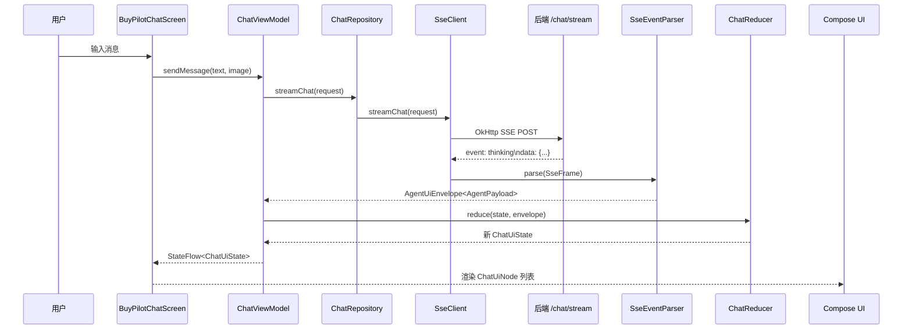

# BuyPilot Android CodeMap

> 调试与改进指南 — 快速理解代码结构、定位问题、找到改进切入点

---

## 一、模块结构总览

```
android/
├── app/                          # 应用入口
│   ├── MainActivity.kt           # 主 Activity
│   ├── SplashActivity.kt         # 启动页
│   └── navigation/AppNavGraph.kt # 导航图
│
├── feature/
│   └── chat/                     # ★ 核心功能模块（90% 的工作在这里）
│       ├── ChatViewModel.kt      # 状态管理 + 业务编排（~900 行）
│       ├── ChatRoute.kt          # 导航入口
│       ├── model/                # UI 节点模型（ChatUiNode 密封类）
│       ├── state/                # 状态 + Reducer（纯函数）
│       ├── ui/                   # Compose UI 组件
│       ├── presentation/         # 展示层（节点 → 渲染参数）
│       └── tts/                  # 文字转语音
│
├── core/
│   ├── network/                  # 网络层（SSE 连接 + API 接口）
│   │   ├── SseClient.kt          # OkHttp SSE 客户端
│   │   ├── SseEventParser.kt     # SSE JSON → AgentPayload
│   │   ├── ChatApi.kt            # 聊天 API 接口
│   │   ├── CartApi.kt            # 购物车 API
│   │   ├── ImageUploadApi.kt     # 图片上传
│   │   └── RestClient.kt         # Retrofit 配置
│   │
│   ├── data/                     # 数据仓库
│   │   └── ChatRepository.kt     # 消费 SSE 流 + 购物车 + 图片
│   │
│   ├── database/                 # Room 本地存储
│   │   ├── AppDatabase.kt
│   │   └── dao/                  # SessionDao, MessageDao
│   │
│   ├── model/                    # 共享数据模型
│   │   ├── AgentPayload.kt       # SSE 事件载荷（密封类）
│   │   ├── AgentEventType.kt     # 事件类型枚举
│   │   └── SharedPayloads.kt     # 共享子结构
│   │
│   └── common/                   # 通用工具
│       ├── sse/                  # SSE 帧解析
│       ├── id/Ids.kt             # ID 生成器
│       └── time/Clock.kt         # 时钟抽象
```

---

## 二、核心数据流

理解这个流程是调试一切问题的基础：



### 简化版（记住这个就够）

```
用户输入 → ChatViewModel → ChatRepository → SseClient → 后端
    ↓
后端 SSE 事件 → SseEventParser → ChatViewModel.applyEnvelope()
    ↓
ChatReducer.reduce() → 新 ChatUiState → Compose UI 渲染
```

---

## 三、调试速查表

### 按问题类型定位文件

| 问题类型 | 先看这个文件 | 再看 |
|---------|------------|------|
| **SSE 解析错误** | `core/network/SseEventParser.kt` | `core/model/AgentEventType.kt`, `AgentPayload.kt` |
| **UI 不渲染/渲染错** | `feature/chat/state/ChatReducer.kt` | `model/ChatUiNode.kt`, `ui/ChatTimeline.kt` |
| **网络/连接失败** | `core/network/SseClient.kt` | `ChatApi.kt`, `RestClient.kt` |
| **状态不对** | `feature/chat/state/ChatUiState.kt` | `ChatReducer.kt` |
| **商品卡片问题** | `ui/ProductSwipeComponents.kt` | `ChatReducer.reduceProductCard()` |
| **购物车问题** | `ChatReducer.kt` 第 109-155 行 | `CartActionNode`, `CartApi.kt` |
| **图片上传失败** | `ChatViewModel.selectImage()` | `ImageUploadApi.kt` |
| **对比功能** | `ui/CompareComponents.kt` | `ChatReducer.reduceCompareNarration()` |
| **思考阶段不显示** | `ChatReducer.reduce()` Thinking 分支 | `ThinkingNode`, `ThinkingPayload` |
| **最终决策卡问题** | `ChatReducer.reduceFinalDecision()` | `FinalDecisionNode` |

### 核心文件详解

| 文件 | 行数 | 职责 | 修改频率 |
|------|------|------|---------|
| `ChatViewModel.kt` | ~900 | 业务编排：消息发送、流消费、图片上传、购物车 | 高 |
| `ChatReducer.kt` | ~1000 | 纯函数：SSE 事件 → UI 状态转换 | 高 |
| `BuyPilotChatScreen.kt` | ~2000 | 主界面 Compose | 中 |
| `ChatTimeline.kt` | ~1500 | 时间轴渲染 | 中 |
| `SseEventParser.kt` | 139 | SSE JSON → AgentPayload | 低 |
| `ChatRepository.kt` | 146 | 数据仓库：SSE 流 + 购物车 + 图片 | 低 |

---

## 四、SSE 事件类型 → UI 节点映射

这是前后端协议的核心，改任何一端都要同步另一端：

| 后端事件 | Payload 类型 | UI 节点 | 渲染组件 |
|---------|-------------|---------|---------|
| `thinking` | `ThinkingPayload` | `ThinkingNode` | ThinkingBubble |
| `clarification` | `ClarificationPayload` | `ClarificationNode` | ClarificationCard |
| `criteria_card` | `CriteriaCardPayload` | `CriteriaNode` | CriteriaCard |
| `text_delta` | `TextDeltaPayload` | `AiStreamNode` | AiStreamBubble |
| `product_card` | `ProductCardPayload` | `ProductDeckNode` | ProductDeck |
| `cart_action` | `CartActionPayload` | `CartActionNode` | CartActionCard |
| `final_decision` | `FinalDecisionPayload` | `FinalDecisionNode` | FinalDecisionCard |
| `compare_card` | `CompareCardPayload` | `CompareCardNode` | CompareCard |
| `done` | `DonePayload` | (无节点，控制状态) | - |
| `error` | `ErrorPayload` | `ErrorNode` | ErrorCard |

> **铁律**：新增事件类型需要同步修改 `AgentEventType.kt` → `SseEventParser.kt` → `ChatReducer.kt` → `ChatUiNode.kt` → UI 组件

---

## 五、状态管理

### ChatInputState（输入框状态机）

```
┌──────┐     ┌───────────┐     ┌───────────┐     ┌──────┐
│ Idle │────→│ Composing │────→│ Streaming │────→│ Idle │
└──────┘     └───────────┘     └───────────┘     └──────┘
                  ↓                  ↓       ↑
            ┌──────────────┐   ┌───────┐  │
            │ImageAttached │   │ Error │──┘ (retry)
            └──────────────┘   └───────┘
                  ↓              ↓
              Streaming      Canceled ──→ Idle
```

### ChatUiState 关键字段

| 字段 | 类型 | 说明 |
|------|------|------|
| `nodes` | `List<ChatUiNode>` | 所有 UI 节点（消息历史） |
| `inputState` | `ChatInputState` | 输入框状态 |
| `isStreaming` | `Boolean` | 是否正在流式接收 |
| `sessionId` | `String?` | 会话 ID（首次从后端获取） |
| `currentTurnId` | `String?` | 当前轮次 ID |
| `cartState` | `CartState` | 购物车状态 |
| `productSwipeStates` | `Map<String, ProductSwipeState>` | 每个商品卡片的滑动状态 |
| `lastError` | `String?` | 最后一次错误信息 |
| `lastUserMessage` | `String?` | 最后一条用户消息（用于重试） |

---

## 六、依赖注入

使用 Hilt（Dagger 的 Android 版本）：

| Module | 位置 | 提供的依赖 |
|--------|------|-----------|
| `NetworkModule` | `core/network/di/` | OkHttpClient, SseClient, ChatApi, CartApi, ImageUploadApi, Json |
| `DatabaseModule` | `core/database/di/` | AppDatabase, SessionDao, MessageDao |
| `CommonModule` | `core/common/di/` | Dispatchers (IO/Main), Clock |

**注入方式**：`@Inject constructor(...)` 或 `@HiltViewModel`

---

## 七、常见调试场景

### 场景 1：消息发送后无响应

**排查步骤**：

1. **确认 ViewModel 方法被调用**
   - 在 `ChatViewModel.sendMessage()` 加日志

2. **检查网络请求**
   - Logcat 过滤 `OkHttp` 看请求/响应
   - 确认后端已启动（`http://localhost:8000/health`）

3. **检查 SSE 连接**
   - `SseClient.kt` 的 `onFailure` 回调会打印错误
   - 看 `SseClient.kt:61-67`

4. **检查 BaseUrl**
   - `BaseUrlProvider.kt` — 模拟器用 `10.0.2.2:8000`，真机用宿主机 IP

### 场景 2：UI 卡片不显示

**排查步骤**：

1. **确认事件到达 ViewModel**
   - 在 `ChatViewModel.applyEnvelope()` 加日志，打印 `envelope.event`

2. **检查 Reducer 分支**
   - `ChatReducer.reduce()` 的 `when (envelope.event)` 对应分支
   - 确认节点被添加到 `state.nodes`

3. **检查 UI 渲染**
   - `ChatTimeline.kt` 的 `when (node)` 对应分支
   - 确认 Composable 被调用

### 场景 3：商品卡片滑动异常

**排查步骤**：

1. **检查状态转换**
   - `ChatReducer.swipeProduct()` — 看 `swipedProductIds` 和 `currentProductId`

2. **检查 ProductSwipeState**
   - `feature/chat/model/ProductSwipeState.kt`

3. **检查手势处理**
   - `ui/ProductSwipeComponents.kt` 的 `PagerState` 和 `Modifier.pointerInput`

### 场景 4：购物车加购失败

**排查步骤**：

1. **检查 cart_action 事件**
   - `ChatReducer.kt:109-155` — CartAction 分支

2. **检查购物车状态**
   - `CartState.items`, `CartState.pendingAddProductIds`

3. **检查后端 API**
   - `CartApi.kt` → `POST /cart/add`

---

## 八、改进切入点（按难度递增）

### Level 1：UI 样式调整 ⭐

**改什么**：`ui/BuyPilotDesign.kt` 的 Colors / Typography / Shapes

**示例**：修改主色调

```kotlin
// ui/BuyPilotDesign.kt
val BuyPilotColors = Colors(
    primary = Color(0xFFxxxxxx),  // 改这里
    // ...
)
```

### Level 2：添加新的 Thinking 阶段 ⭐⭐

**改什么**：扩展 `ThinkingPayload` 的 `stage` 字段处理

**涉及文件**：
- `core/model/AgentPayload.kt` — ThinkingPayload
- `feature/chat/state/ChatReducer.kt` — reduce() Thinking 分支
- `feature/chat/ui/` — ThinkingBubble 渲染

### Level 3：优化错误提示 ⭐⭐

**改什么**：ErrorNode 渲染 + ChatViewModel 的错误处理

**涉及文件**：
- `feature/chat/model/ChatUiNode.kt` — ErrorNode
- `feature/chat/ui/ChatTimeline.kt` — ErrorCard 渲染
- `feature/chat/ChatViewModel.kt` — 错误消息构造

### Level 4：添加新的 SSE 事件类型 ⭐⭐⭐

**需要改的完整链路**：

1. `core/model/AgentEventType.kt` — 添加枚举值
2. `core/model/AgentPayload.kt` — 添加 Payload 类
3. `core/network/SseEventParser.kt` — decodePayload() 添加分支
4. `feature/chat/model/ChatUiNode.kt` — 添加 Node 类
5. `feature/chat/state/ChatReducer.kt` — reduce() 添加分支
6. `feature/chat/ui/ChatTimeline.kt` — 添加渲染组件

### Level 5：性能优化 ⭐⭐⭐⭐

**优化点**：
- `ChatTimeline.kt` 的 LazyColumn — 添加 `key` 优化 diff
- 减少不必要的重组 — 使用 `remember` 和 `derivedStateOf`
- 大图加载 — 使用 Coil 的 `ImageRequest.Builder`

---

## 九、构建与运行

### 环境要求

- Android Studio Ladybug (2024.3) 或更新
- JDK 17
- Android SDK 35
- Kotlin 2.0+

### 启动步骤

```bash
# 终端 1：启动后端（项目根目录）
make up

# 终端 2：启动 Android
# 1. 用 Android Studio 打开 android/
# 2. 等待 Gradle 同步完成
# 3. 选择模拟器或真机
# 4. 点击 Run (▶️)
```

### ⚠️ 后端地址配置（重要）

Android 端连接后端的地址，**必须根据运行环境正确配置**，否则 App 无法与后端通信。

配置位置：`android/core/network/src/main/java/com/buypilot/core/network/BaseUrlProvider.kt`

```kotlin
class BaseUrlProvider @Inject constructor() {
    val baseUrl: String = "http://10.0.2.2:8000"  // ← 改这里
}
```

| 运行环境 | 地址 | 说明 |
|---------|------|------|
| **模拟器** | `http://10.0.2.2:8000` | `10.0.2.2` 是 Android 模拟器对宿主机 localhost 的固定映射 |
| **真机调试** | `http://<宿主机局域网IP>:8000` | 手机和电脑必须在同一局域网，如 `http://192.168.1.100:8000` |

> **常见坑**：模拟器里配了 `localhost` 或 `127.0.0.1` → 连不上后端。必须用 `10.0.2.2`。

---

## 十、测试

### 运行单元测试

```bash
cd android

# 全部测试
./gradlew testDebugUnitTest

# 单个模块
./gradlew :feature:chat:testDebugUnitTest
./gradlew :core:network:testDebugUnitTest

# 单个测试类
./gradlew :feature:chat:testDebugUnitTest --tests "com.buypilot.feature.chat.state.ChatReducerTest"
```

### 关键测试文件

| 测试文件 | 覆盖内容 |
|---------|---------|
| `ChatReducerTest.kt` | SSE 事件 → 状态转换 |
| `SseEventParserTest.kt` | SSE JSON 解析 |
| `TimelineRevealStoreTest.kt` | 时间轴显示状态 |
| `CartActionPayloadTest.kt` | 购物车事件模型 |
| `ProductDetailResponseTest.kt` | 商品详情模型 |

---

## 十一、ChatUiNode 完整列表

```kotlin
sealed interface ChatUiNode {
    val key: String  // 唯一标识，用于 diff
}

// 用户消息
data class UserMessageNode(key, content, imageUrl?)

// AI 思考中
data class ThinkingNode(key, payload: ThinkingPayload, turnId)

// AI 流式文本
data class AiStreamNode(key, messageId, content, done, turnId)

// 澄清问题
data class ClarificationNode(key, payload: ClarificationPayload, turnId)

// 购买标准卡片
data class CriteriaNode(key, payload: CriteriaCardPayload, turnId)

// 商品卡片组（可滑动）
data class ProductDeckNode(key, deckId, products: List<ProductCardPayload>, turnId)

// 最终决策
data class FinalDecisionNode(key, payload: FinalDecisionPayload, turnId, deckId?)

// 多商品对比
data class CompareCardNode(key, payload: CompareCardPayload, turnId, ...)

// 购物车操作
data class CartActionNode(key, payload: CartActionPayload, turnId)

// 错误
data class ErrorNode(key, code, message, retryable, turnId)
```

---

## 附录：术语表

| 术语 | 含义 |
|------|------|
| SSE | Server-Sent Events，服务端推送事件流 |
| Envelope | 信封，包裹事件的元数据（session_id, turn_id, seq 等） |
| Payload | 载荷，事件的实际数据内容 |
| Turn | 一轮对话（用户消息 → AI 完整响应） |
| Deck | 商品卡片组，可左右滑动 |
| Reducer | 纯函数，接收旧状态和动作，返回新状态 |
| Composable | Compose UI 函数，用 `@Composable` 注解 |
| StateFlow | Kotlin 协程的响应式状态容器 |
| Hilt | Android 依赖注入框架 |
| Room | Android SQLite ORM |

---

*最后更新：2026-06-07*
