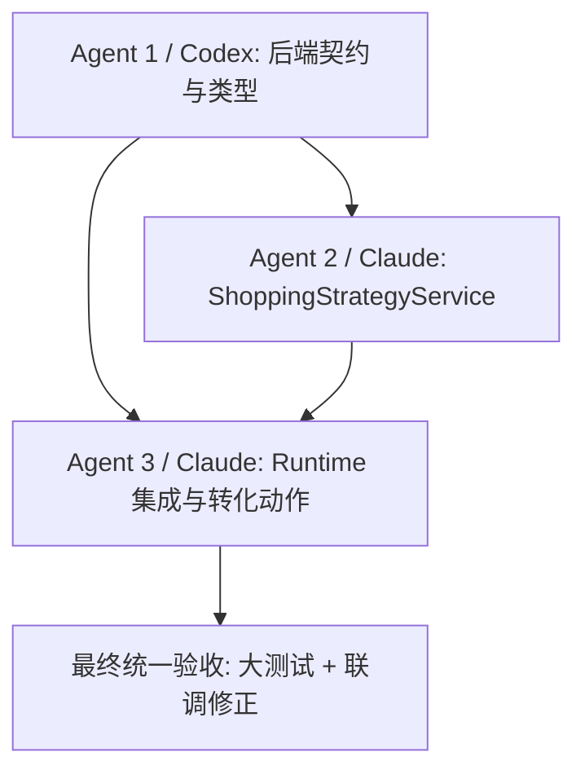

# 07 场景化选购转化后端并行开发总图

## 目标

把 `doc/prd/07-场景化选购助手PRD.md` 的 P0 后端能力落地：

- `criteria_card.shopping_strategy` 可选字段
- `shopping_strategy.decision_barrier` 购买阻力识别
- 场景化 turn 先输出场景判断和选购思路，再输出商品
- 商品 reason 服务转化阻力
- `final_decision.decision_status == selected` 时下发 `add_to_cart` next action

前端由队友负责，本目录只交接前端契约，不分配前端实现。

## 并行依赖图



文本版：

1. Agent 1 先定义后端/JSON schema 的稳定契约。
2. Agent 2 基于 Agent 1 的类型实现独立服务，尽量不碰 runtime。
3. Agent 3 基于 Agent 1/2 的接口接入流式链路，并补 final_decision 加购动作。
4. 三个 agent 只跑小测试。最终由主控统一跑大测试和修冲突。

## 文件 ownership

| Agent | 主要 owned files | 尽量不要碰 |
|------|------------------|------------|
| Agent 1 / Codex | `contracts/sse-events.schema.json`, `backend/src/types/sse_events.py`, 类型/契约小测试 | `backend/src/runtime/handlers.py`, Android |
| Agent 2 / Claude | `backend/src/services/shopping_strategy.py`, `backend/prompts/shopping_strategy.md`, `backend/tests/test_shopping_strategy.py` | `backend/src/runtime/handlers.py`, Android |
| Agent 3 / Claude | `backend/src/runtime/handlers.py`, `backend/src/services/recommendation_reasons.py` 如确需, runtime 小测试 | `contracts/sse-events.schema.json`, Android |

## 合并顺序

1. 先合 Agent 1：确保类型和 schema 可用。
2. 再合 Agent 2：确保 service 单测过。
3. 最后合 Agent 3：解决 runtime import/接口冲突。
4. 主控统一跑较大范围测试：
   - 后端目标测试集
   - SSE schema 校验
   - 场景化 demo smoke
   - 必要时 Android 解析小测由前端同学跑

## 小测试原则

三个 agent 都不要跑全量测试，不要起完整大 smoke。每个 agent 只跑自己新增或直接相关的小测试，例如：

```bash
timeout 180s backend/.venv/bin/python -m pytest backend/tests/test_xxx.py
```

如果本地环境没有 `backend/.venv`，改用项目当前可用的 pytest 命令，但仍只跑目标小测试。

