# BuyPilot 问题记录与代码核查报告

更新时间：2026-05-27

本文档把真实截图、前后端代码路径和产品预期合并成一份可执行问题清单。重点不是记录“看起来哪里怪”，而是明确每个问题是否存在、归因在哪一层、应该怎么修，以及修完后如何验收。

## 核查结论总览

| 编号 | 问题 | 当前判断 | 优先级 | 主要归因 |
| --- | --- | --- | --- | --- |
| 0 | 后端流程未严格对齐 SwipeDeck 分阶段决策链路 | 确认存在 | P0 | 后端 PRD 与代码是快流式流水线，不是用户反馈后再决策 |
| 1 | 后端追问门槛太低，用户没说完整也直接生成标准或推荐 | 确认存在 | P0 | 后端 slot rule 只判断可检索，不判断可推荐 |
| 2 | 模糊需求下出现推断过度、追问幻觉、回答后仍循环追问 | 确认存在 | P1 | criteria LLM 允许基于历史/上下文补全，slot 状态未稳定合并 |
| 3 | 按设计应先确认购买标准，但并非每次阻断推荐 | 确认存在 | P0 | `_should_continue_after_criteria` 把普通购物词当继续命令 |
| 4 | 模糊问题不能一步步深入到大致范围 | 确认存在 | P1 | 只有 category/product_type 两层通用追问，无品类化追问策略 |
| 5 | 有些常见品类没有，部分食品类还存在命名不一致风险 | 确认存在 | P1 | 数据范围有限，且 `食品饮料` 与 `食品生活` 未统一 |
| 6 | 应回复“继续”后才进入初步筛选 | 确认存在 | P0 | 后端自动继续逻辑过宽，前端 criteria patch 也会跳过确认 |
| 7 | 初步筛选后才给最终建议卡 | 后端存在，Android 已部分缓解 | P1 | 后端同轮发送 final_decision，前端缓存等待用户收敛 |
| 8 | 初选文字复杂，主时间线认知负担重 | 部分存在 | P2 | 后端推荐解释仍是长段落，前端仅做了渲染和顺序缓解 |
| 9 | 说出具体需求后仍继续追问 | 确认存在 | P1 | 当前轮 intent 抽取失败或不支持品类时，slot check 仍回到泛化追问 |

## 图片归档

问题截图已统一放在 `doc/problem_examples/`：

| 图片 | 对应问题 |
| --- | --- |
| 无截图 | 问题 0：后端流程架构与前端 SwipeDeck 决策链路不一致 |
| `problem_examples/issue-01-oily-cleanser-inferred-criteria.png` | 问题 1：油皮洗面奶被补全预算/场景 |
| `problem_examples/issue-01-phone-photo-no-budget.png` | 问题 1：手机拍照需求未问预算 |
| `problem_examples/issue-02-vague-photo-skin-clarification.png` | 问题 2：模糊拍照需求被引到护肤追问 |
| `problem_examples/issue-02-repeated-clarification-after-answer.png` | 问题 2：回答肤质后继续循环追问 |
| `problem_examples/issue-02-inferred-criteria-overfill.png` | 问题 2：criteria 被补全预算/排除项 |
| `problem_examples/issue-03-confirmation-required.png` | 问题 3：标准确认文案与实际流程不一致 |
| `problem_examples/issue-04-vague-category-to-criteria.png` | 问题 4：模糊品类进入标准卡 |
| `problem_examples/issue-04-category-clarification-card.png` | 问题 4：只能泛化问品类 |
| `problem_examples/issue-04-continue-loops-to-clarification.png` | 问题 4：继续后又回到追问 |
| `problem_examples/issue-05-common-category-empty-result.png` | 问题 5：常见品类无匹配商品 |
| `problem_examples/issue-06-phone-before-explicit-confirm.png` | 问题 6：手机需求在未显式确认前已有候选商品 |
| `problem_examples/issue-07-initial-selection-before-decision.png` | 问题 7：初筛与最终建议阶段边界不清 |
| `problem_examples/issue-08-heavy-initial-selection-text.png` | 问题 8：候选商品后长文过重 |
| `problem_examples/issue-09-cd-player-specific-criteria.png` | 问题 9：CD 机被泛化为数码电子标准 |
| `problem_examples/issue-09-specific-demand-still-criteria.png` | 问题 9：具体需求仍进入确认标准 |
| `problem_examples/issue-09-continue-after-specific-demand-loops.png` | 问题 9：继续后又追问品类 |

## 问题 0：后端流程未严格对齐 SwipeDeck 分阶段决策链路

### 前端目标链路

前端当前设计遵循的是一条分阶段收敛的导购链路：

```text
用户需求
→ 标准结构化
→ 用户确认/修改标准
→ 后端检索/排序
→ SwipeDeck 初选候选商品
→ 用户反馈/查看详情/查看证据
→ 最终决策或继续收敛
```

这条链路的核心是：最终决策应该发生在用户看过候选商品、表达喜欢/不喜欢、排除或查看详情之后。SwipeDeck 不是单纯展示层，而是决策收敛过程的一部分。

### 后端当前链路

后端 PRD 和真实代码更接近一条快流式流水线：

```text
用户需求
→ intent
→ criteria_card
→ retrieval/rerank
→ product_card
→ recommendation text
→ final_decision
→ done
```

### 是否存在

确认存在。

### PRD 证据

- `doc/prd/02-后端与AgentPRD.md:60`：后端 PRD 明确写了“默认流式推进，不等用户确认”。
- `doc/prd/02-后端与AgentPRD.md:376` 到 `382`：PRD 时间线是 criteria 完成后继续 yield product_card、recommendation、final_decision、done。
- `doc/prd/02-后端与AgentPRD.md:70`：反馈闭环定义为“影响同一会话下一轮推荐”，不是当前 deck 初选后再收敛。
- `doc/prd/02-后端与AgentPRD.md:880` 到 `884`：用户反馈写入 feedbacks 表后，在下一轮对话中查询并注入 criteria。

### 代码证据

- `backend/src/runtime/handlers.py:249`：后端发送 `criteria_card`。
- `backend/src/runtime/handlers.py:250`：如果 `_should_continue_after_criteria` 为 true，就不会停在标准确认阶段。
- `backend/src/runtime/handlers.py:256`：直接进入 `continue_recommendation_from_criteria`。
- `backend/src/runtime/handlers.py:303` 到 `314`：在发送 product_card 前，后端已经启动 recommendation 和 decision 后台任务。
- `backend/src/runtime/handlers.py:317`：发送 product_card。
- `backend/src/runtime/handlers.py:334`：发送 recommendation text。
- `backend/src/runtime/handlers.py:352`：同一轮发送 final_decision。
- `backend/src/api/feedback.py:15`：`POST /feedback` 只是记录反馈，不触发当前 deck 的收敛决策。

### 根因

后端设计目标是压低首屏和首个商品卡延迟，所以选择“一轮完整跑完”的流式流水线；前端设计目标是让用户参与候选商品初选，再做最终判断。两者产品哲学不同：

- 后端：尽快给完整答案。
- 前端：先给候选，让用户参与收敛，再给最终答案。

因此现在 Android 前端只能在展示层补救：收到提前到达的 `final_decision` 后先缓存，等用户回复“继续/收敛”再展示。这能让当前 Android UI 看起来接近目标流程，但后端契约本身并没有真正支持“用户反馈后再决策”。

### 风险

1. Android 以外的客户端会直接看到过早的 final_decision。
2. 用户在 SwipeDeck 中的 like/dislike/view_detail 不会影响已经生成好的 final_decision。
3. 后端 `final_decision` 语义会变弱：它不是“结合用户初选后的最终决策”，而是“基于初始召回列表的自动结论”。
4. 前端缓存逻辑越做越重，后续容易出现状态不一致，例如 pending decision 属于旧 deck、用户反馈后仍展示旧结论。

### 修复建议

1. 后端补充分阶段 finish reason：
   - `awaiting_criteria_confirmation`
   - `awaiting_product_feedback`
   - `completed`
2. 首轮推荐只发送 `criteria_card`，等待用户确认后再进入检索。
3. 标准确认后只发送 `product_card × n`，然后 `done(finish_reason=awaiting_product_feedback)`，不要同轮发送 final_decision。
4. 用户 swipe/like/dislike/view_detail 通过 `/feedback` 写入当前 `deck_id` 维度反馈。
5. 用户回复“继续/收敛建议”时，后端读取当前 deck 的反馈和候选商品，再生成 `final_decision`。
6. 如果短期不改后端，保留 Android 的 pending decision 缓存逻辑，但要明确这是兼容层，不是最终契约。

### 建议后端契约

```text
Turn 1:
thinking → criteria_card → done(awaiting_criteria_confirmation)

Turn 2:
thinking → product_card × n → done(awaiting_product_feedback, deck_id=...)

Feedback:
POST /feedback { session_id, deck_id, product_id, action, feedback_type }

Turn 3:
message="继续" / "收敛建议"
→ thinking → final_decision → done(completed)
```

### 验收用例

- 首轮用户输入“推荐适合油皮的洗面奶”后，只出现标准卡，不出现商品卡和 final_decision。
- 用户确认标准后，只出现候选商品 deck，不出现 final_decision。
- 用户对 deck 内商品执行 like/dislike/view_detail 后，回复“继续”，最终建议应能体现这些反馈。
- 后端 SSE 中 `final_decision` 不应早于 `awaiting_product_feedback` 阶段之后出现。
- Android 前端不再需要依赖“缓存提前到达的 final_decision”来模拟分阶段流程。

## 问题 1：后端追问门槛太低

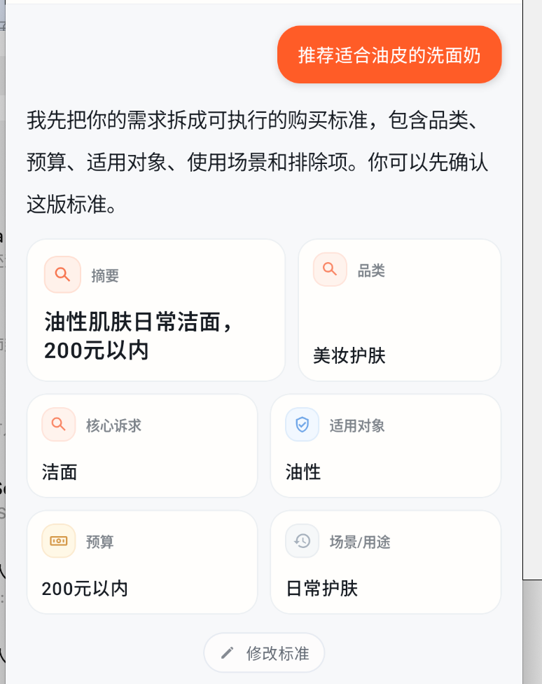

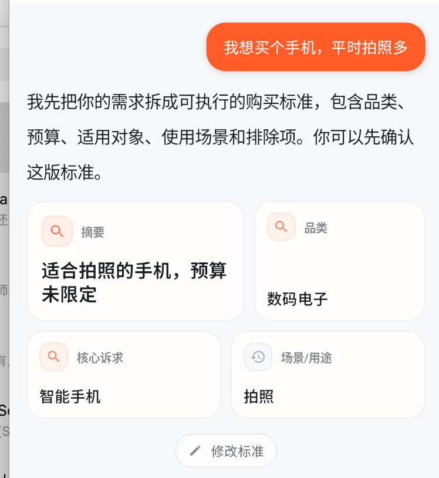

### 现象

用户只说“推荐适合油皮的洗面奶”，系统生成了“日常护肤、200 元以内”等标准。用户只说“我想买个手机，平时拍照多”，系统也可以整理出标准并继续推荐，但没有先问预算、系统偏好、存储、品牌偏好等关键问题。

### 是否存在

确认存在。

### 代码证据

- `backend/src/runtime/stages/slot_checker.py:10`：`_NARROWING_CONSTRAINT_KEYS` 只要出现 `budget_max / skin_type / use_scenario / sport_type` 等任一字段，就认为已经缩窄。
- `backend/src/runtime/stages/slot_checker.py:23`：已知品类下，只要有 `product_type`，或有 narrowing constraint，就不再追问。
- `backend/src/runtime/handlers.py:249`：后端会先发 criteria card，但后续是否等待确认由 `_should_continue_after_criteria` 决定。

### 根因

当前后端把“可检索”当成了“可推荐”。对 RAG 来说，`手机 + 拍照` 已经能召回商品；但对真实导购来说，手机价格跨度极大，没有预算和生态偏好时直接推荐会显得草率。

### 修复建议

1. 引入“推荐就绪度”规则，把 `can_generate_criteria` 和 `can_recommend` 分开。
2. 为高价高差异品类增加必问字段，例如手机必须至少确认预算或价位带。
3. 对 LLM 推断字段增加 provenance，区分 `用户明确提出 / 系统推断 / 继承自上一轮`。
4. UI 文案改成“我根据你的描述整理了一版购买标准，部分字段可修改”，避免让用户误以为字段都是自己说过的。

### 验收用例

- 输入“我想买个手机，平时拍照多”时，不应直接出现商品卡；应先出现标准卡，并追问预算或价位范围。
- 输入“推荐适合油皮的洗面奶”时，若补全“日常护肤”等字段，应在 UI 或字段元信息中标注为系统推断。

## 问题 2：模糊需求下追问幻觉与循环追问

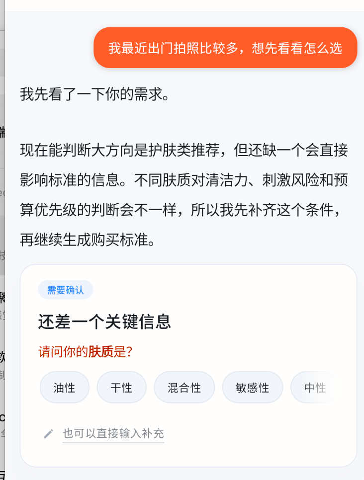

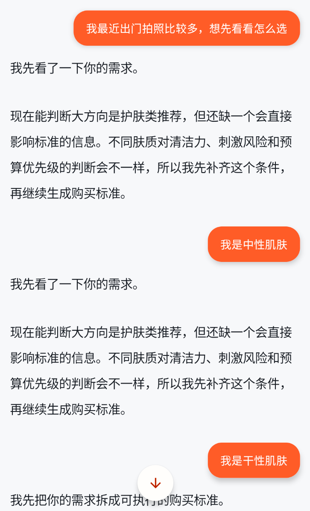

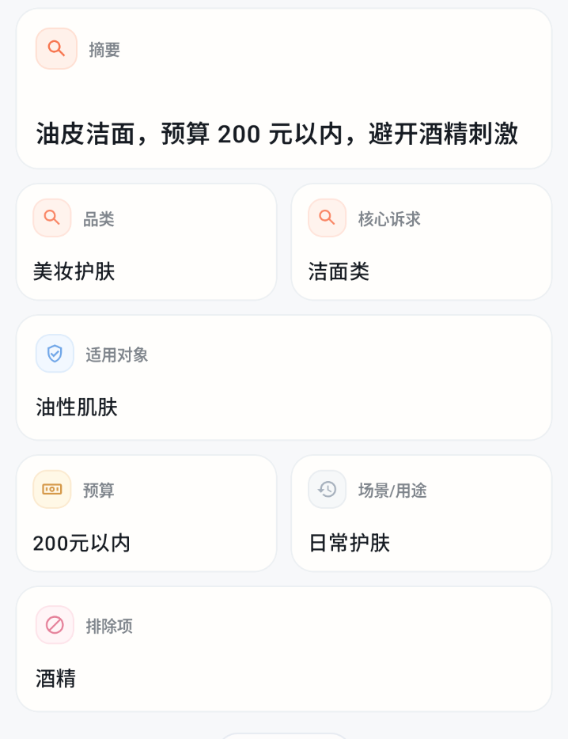

### 现象

用户说“最近出门拍照比较多，想先看看怎么选”，系统把它理解成护肤类推荐并追问肤质。用户回答“我是中性肌肤 / 我是干性肌肤”后，仍可能重复相似的追问，随后又生成了预算和排除项等用户没有明确说出的字段。

### 是否存在

确认存在。

### 代码证据

- `backend/src/runtime/pipeline.py:188`：每轮先做 `_missing_slots`，缺槽位就直接发 clarification。
- `backend/src/runtime/pipeline.py:247`：`_missing_slots` 只看当前请求与当前 intent，没有显式合并上一轮已追问槽位。
- `backend/src/runtime/pipeline.py:258`：澄清前会把 partial criteria 保存到会话状态。
- `backend/src/runtime/stages/criteria.py:16`：criteria 生成会读取 `get_previous_criteria(session_id)`。
- `backend/src/runtime/stages/criteria.py:21`：criteria LLM 同时接收当前消息、feedback、existing 和 conversation_context。
- `backend/prompts/criteria_generation.md:67`：prompt 要求不编造，但第 68 行又要求有 existing 时在历史标准基础上修改，模型仍可能沿用或扩写旧字段。

### 根因

系统有“保存 partial criteria”的动作，但缺少可靠的“当前回答对应上一个追问槽位”的状态机。短回答可能被当成新一轮模糊需求重新跑 intent，导致追问循环。另一方面，criteria LLM 接收 existing 和 conversation_context 后，容易把推断字段或旧字段写进新标准。

### 修复建议

1. 在会话状态里保存 `pending_clarification_slot`，用户回答后先合并到上一轮 criteria，再做 slot check。
2. 澄清回答使用确定性映射，例如“中性肌肤”直接写入 `constraints.skin_type=中性`。
3. 对 `existing` 的继承加白名单：预算、排除项、品牌偏好这类硬约束必须用户明确保留或本轮明确表达。
4. 标准卡字段增加来源标记，避免推断字段伪装成用户输入。

### 验收用例

- 输入模糊问题后，如果系统追问肤质，用户回答“我是中性肌肤”，下一轮不应继续问同一问题。
- 新会话中用户没有说预算时，标准卡不应出现具体预算；如果来自历史，应明确标注“继承自上一轮”。

## 问题 3：购买标准确认没有稳定阻断推荐

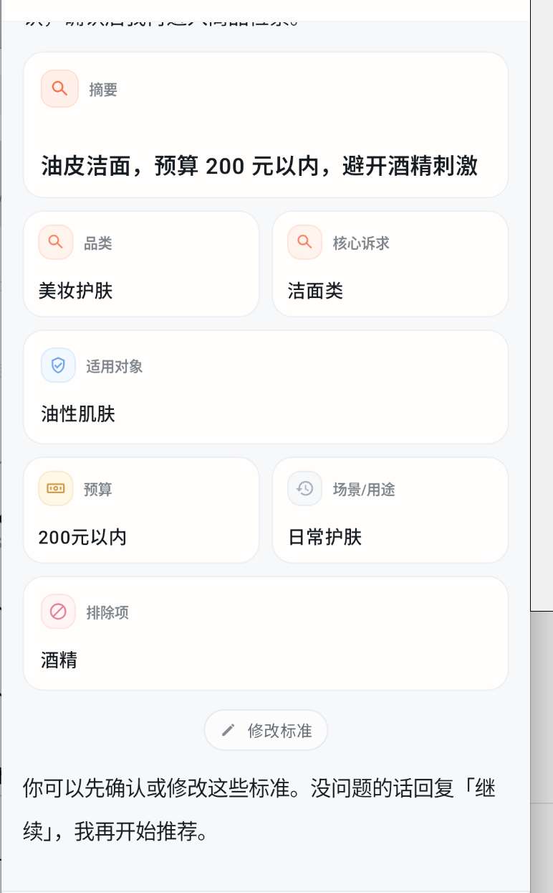

### 现象

产品设计要求先确认购买标准，用户回复“继续”后再筛选。但真实后端会把很多首轮购物请求直接视为继续，导致标准卡和候选商品在同一轮里连续出现。

### 是否存在

确认存在。

### 代码证据

- `backend/src/runtime/handlers.py:249`：先发 criteria card。
- `backend/src/runtime/handlers.py:250`：只有 `_should_continue_after_criteria(body)` 为 false 时才发确认文案并 return。
- `backend/src/runtime/handlers.py:507`：只要 skip_stages 里有 `recommendation`，或 `_is_continue_command` 为 true，就继续推荐。
- `backend/src/runtime/handlers.py:531`：`_has_shopping_constraints` 包含“推荐、想要、帮我、适合、手机、洁面”等普通购物词。
- `android/feature/chat/src/main/java/com/buypilot/feature/chat/ChatViewModel.kt:104`：前端标准编辑保存会发送 `skipStages = listOf("recommendation")`，后端会把它解释为继续推荐。

### 根因

`_is_continue_command` 同时承担了两件事：识别用户是否在购物，以及识别用户是否确认继续。它把普通购物约束误当成了确认命令。

### 修复建议

1. 将“购物约束充足”与“用户确认继续”拆成两个函数。
2. 默认首轮推荐请求只生成标准卡并等待确认，除非请求中有明确 `skip_stages` 或客户端显式标记 auto-run。
3. `skipStages=["recommendation"]` 的语义需要重新命名或调整，避免“保存标准”被误解释为“跳过确认并推荐”。

### 验收用例

- 输入“为我推荐一双运动鞋”时，只出现标准卡和确认提示，不应立刻出现候选商品。
- 用户回复“继续”后，才出现候选商品。

## 问题 4：模糊问题不能逐步深入到大致范围

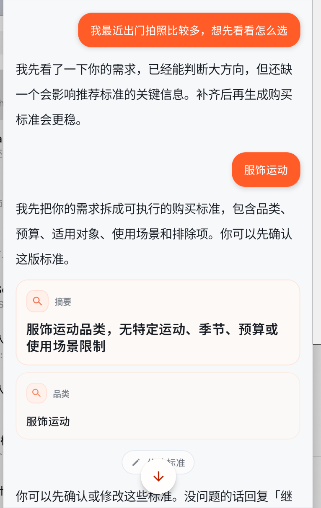

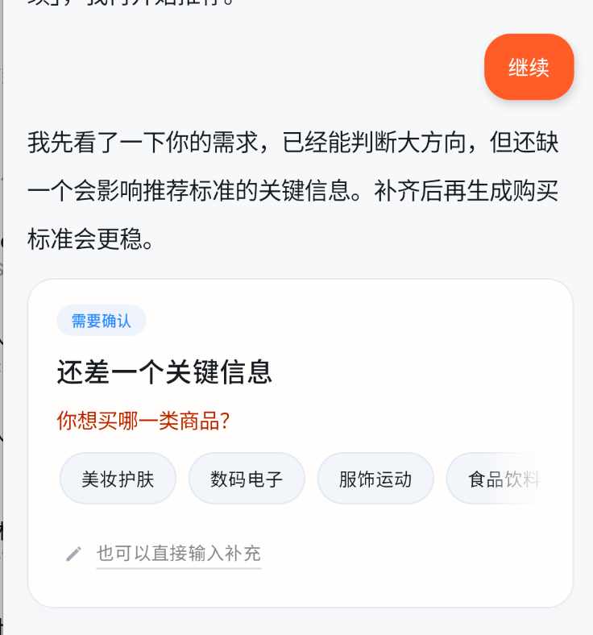

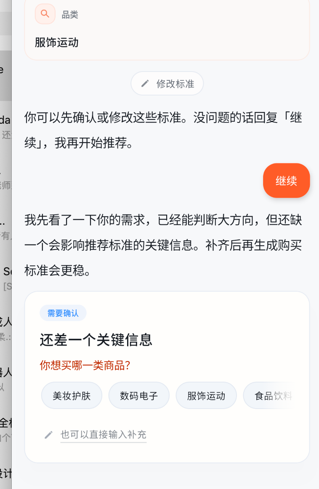

### 现象

对“拍照怎么选”“服饰运动”这类模糊输入，系统要么直接生成很粗的标准卡，要么只问“你想买哪一类商品？”，不能像导购一样逐步确认场景、预算、偏好和排除项。

### 是否存在

确认存在。

### 代码证据

- `backend/src/runtime/stages/slot_checker.py:34`：只有 `category` 和 `product_type` 两类澄清问题。
- `backend/src/runtime/stages/slot_checker.py:36`：缺 category 时只给四个大品类。
- `backend/src/runtime/stages/slot_checker.py:38`：缺 product_type 时只问“你想买具体哪一类商品？”

### 根因

槽位系统目前是通用的两层规则，不是品类化导购策略。它能确定“属于哪个大类”，但不能判断“这个品类还缺哪些关键决策信息”。

### 修复建议

1. 增加品类化追问策略：
   - 手机：预算、系统生态、拍照/游戏/续航/轻薄优先级。
   - 护肤：肤质、预算、敏感/酒精/香精等排除项。
   - 运动鞋：运动类型、路面/场景、预算、尺码/脚型。
   - 食品饮料：无糖/低糖/咖啡因/乳制品等饮食限制。
2. 一次只问一个最关键问题，回答后进入下一层，不重复上一层问题。
3. 每次追问都应展示“已确认”和“还缺”的上下文。

### 验收用例

- “我最近出门拍照比较多，想先看看怎么选”应先确认是手机/相机/护肤防晒/穿搭，而不是直接跳到护肤肤质。
- “服饰运动”应先问运动场景或具体商品类型，再问预算，不应直接生成完整标准。

## 问题 5：常见品类缺失与食品类命名不一致

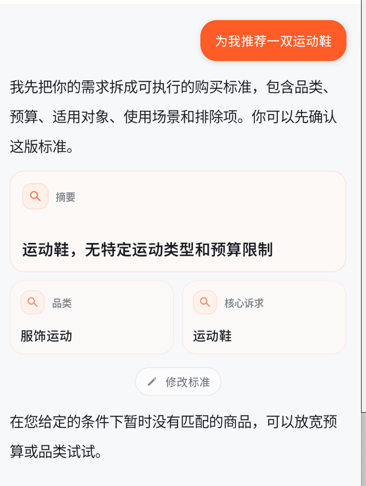

### 现象

一些常见需求会显示无匹配商品。这里有两类原因：一类是数据集本身没有覆盖，例如 CD 机；另一类是食品类命名存在契约不一致，可能导致明明有食品数据却召回为空。

### 是否存在

确认存在。

### 代码证据

- `data/processed/products.json` 中食品商品的 `category` 是 `食品生活`。
- `backend/src/config/domain_terms.py:22`、`backend/src/runtime/stages/slot_checker.py:7`、`backend/prompts/intent_analysis.md:29` 使用的是 `食品饮料`。
- `backend/src/services/llm_task_payloads.py:396` 会把 `食品生活` 归一成 `食品饮料`。
- `backend/src/services/retriever.py:366` 的 category hard filter 使用严格等值：`product.category == criteria.category`。

### 根因

数据、prompt、领域词和检索硬过滤没有使用同一套 canonical category。食品类尤其危险：criteria 可能是 `食品饮料`，商品事实却是 `食品生活`，严格过滤会直接排空。

### 修复建议

1. 在数据入库或 repo 层统一 canonical category，推荐统一为 `食品饮料`。
2. retriever 的 category filter 支持 alias 映射，至少兼容 `食品生活 <-> 食品饮料`。
3. 对数据集未覆盖的常见品类，前端/后端应明确提示“当前数据暂未覆盖”，不要生成貌似可推荐的标准卡。

### 验收用例

- 输入“推荐无糖饮料/咖啡/零食”应能召回食品类商品。
- 输入“推荐 CD 机”时，如果数据不覆盖，应说明当前商品库暂不覆盖 CD 机，而不是继续泛化追问或空结果。

## 问题 6：应回复“继续”后才进入初步筛选

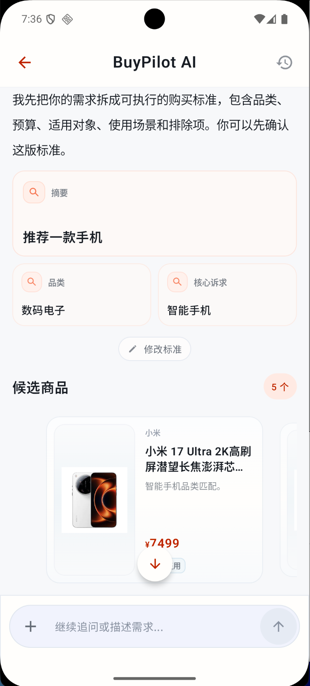

### 现象

截图中，用户只提出“推荐一款手机”，页面已经进入候选商品阶段。按照设计，应先展示购买标准，用户确认或修改后再开始初步筛选。

### 是否存在

确认存在。它和问题 3 是同一个后端自动继续策略导致的两个表现。

### 代码证据

- `backend/src/runtime/handlers.py:507`：`_should_continue_after_criteria` 控制是否继续。
- `backend/src/runtime/handlers.py:511`：`_is_continue_command` 先判断继续词，再回落到 `_has_shopping_constraints`。
- `backend/src/runtime/handlers.py:531`：普通购物词会触发自动继续。

### 修复建议

1. 首轮标准确认阶段默认阻断推荐。
2. 只有明确的确认命令，例如“继续、确认、没问题、开始推荐”，才进入 `continue_recommendation_from_criteria`。
3. “推荐、想要、帮我、手机、洁面”等词只能用于判断购物 intent，不能用于判断确认继续。

### 验收用例

- 输入“推荐一款手机”后，只出现标准卡和确认提示。
- 回复“继续”后，才出现候选商品。

## 问题 7：初筛与最终建议阶段边界不清

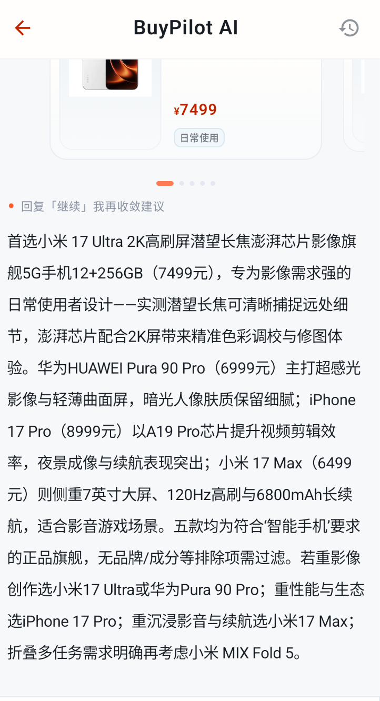

### 现象

设计上应先给候选商品，让用户 swipe/喜欢/排除，再收敛到最终建议卡。后端目前会在同一轮里发送 `product_card`、推荐解释文本和 `final_decision`。

### 是否存在

后端确认存在；Android 前端已做部分缓解。

### 代码证据

- `backend/src/runtime/handlers.py:317`：先发送 product_card。
- `backend/src/runtime/handlers.py:334`：随后发送推荐解释 text_delta。
- `backend/src/runtime/handlers.py:352`：同一轮继续发送 final_decision。
- `android/feature/chat/src/main/java/com/buypilot/feature/chat/state/ChatReducer.kt:292`：前端收到 product_card 后把 deck 标记为 awaiting convergence。
- `android/feature/chat/src/main/java/com/buypilot/feature/chat/state/ChatReducer.kt:312`：如果 deck 仍在等待收敛，前端缓存 final_decision，不立即展示。
- `android/feature/chat/src/main/java/com/buypilot/feature/chat/ChatViewModel.kt:297`：用户回复“继续/收敛”后再展示 pending decision。

### 根因

后端流程仍是单轮完整推荐链路；前端为了符合交互设计，在展示层做了缓存。这个缓解只保护 Android 当前实现，无法保护其他客户端，也会让 SSE 语义不够清晰。

### 修复建议

1. 后端理想流程：criteria confirmed 后只发送 product_card 和 `done(finish_reason=awaiting_product_feedback)`。
2. 用户完成 swipe 或回复“继续/收敛建议”后，再触发 final_decision。
3. 如果短期不改后端，至少把 Android 前端的 pending decision 缓存逻辑补测试，防止回归。

### 验收用例

- 商品候选刚出现时，主时间线不展示最终建议卡。
- 用户喜欢/排除若干商品后，回复“继续”才出现最终建议卡。

## 问题 8：初选文字复杂，占用用户心智

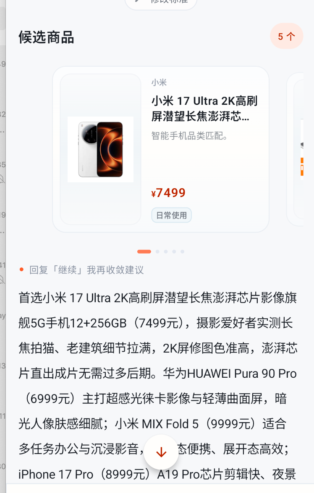

### 现象

候选商品卡已经出现后，下面仍跟着大段推荐解释文字。用户需要先扫商品卡、理解价格和图，再阅读长文，主时间线负担偏重。

### 是否存在

部分存在。前端已经把商品卡放在文字前，Markdown 也已改用库渲染；但后端推荐解释仍然可能生成 2 到 4 段长文，主时间线仍会被撑开。

### 代码证据

- `backend/prompts/recommendation.md:28`：推荐解释允许 `text_chunks` 为 2 到 4 段，每段不超过 100 字。
- `backend/src/runtime/handlers.py:443`：后端将 recommendation text_chunks 转成 text_delta。
- `android/feature/chat/src/main/java/com/buypilot/feature/chat/ui/BuyPilotChatScreen.kt:1334`：前端仍会渲染 AiStreamNode。
- `android/feature/chat/src/main/java/com/buypilot/feature/chat/ui/BuyPilotChatScreen.kt:1825`：Markdown 已使用 Markwon 渲染，手写 Markdown 解析问题已缓解。
- `android/feature/chat/src/main/java/com/buypilot/feature/chat/ui/BuyPilotChatScreen.kt:2806`：候选商品使用 ProductRecommendationStrip，卡片在主流中优先展示。

### 修复建议

1. 主时间线只保留一句摘要，例如“首选小米 17 Ultra，影像和屏幕最贴合你的拍照需求。”
2. 长解释进入详情页、证据页或最终建议底板。
3. 后端 prompt 将 recommendation text 限制为 1 到 2 句摘要，完整比较留给 final_decision 或 evidence。
4. 前端可在存在 product deck 的同一 turn 中折叠推荐长文，只展示摘要和“查看解释”入口。

### 验收用例

- 候选商品出现后，主时间线不应出现超过 2 行的长推荐正文。
- Markdown 加粗、列表、编号不应显示原始符号错乱。

## 问题 9：具体需求仍继续追问

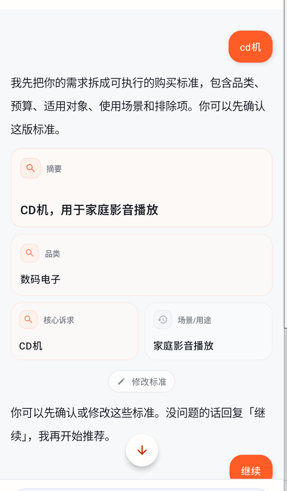

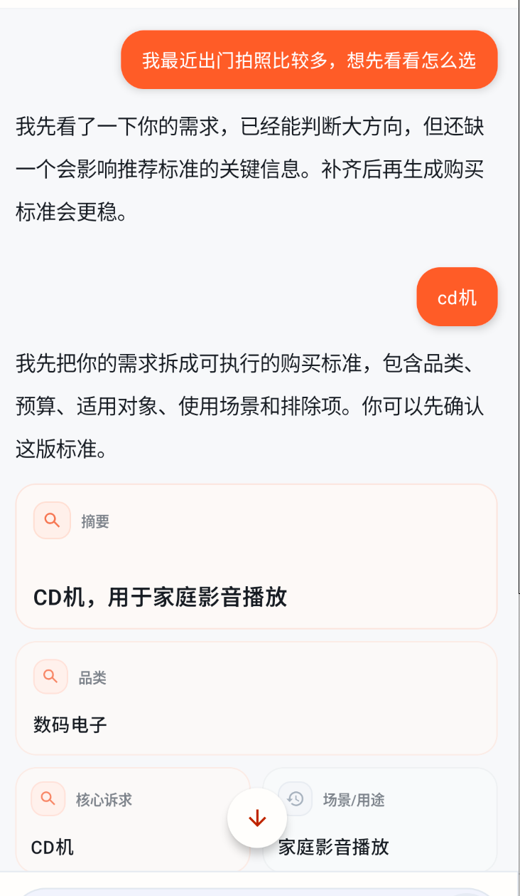

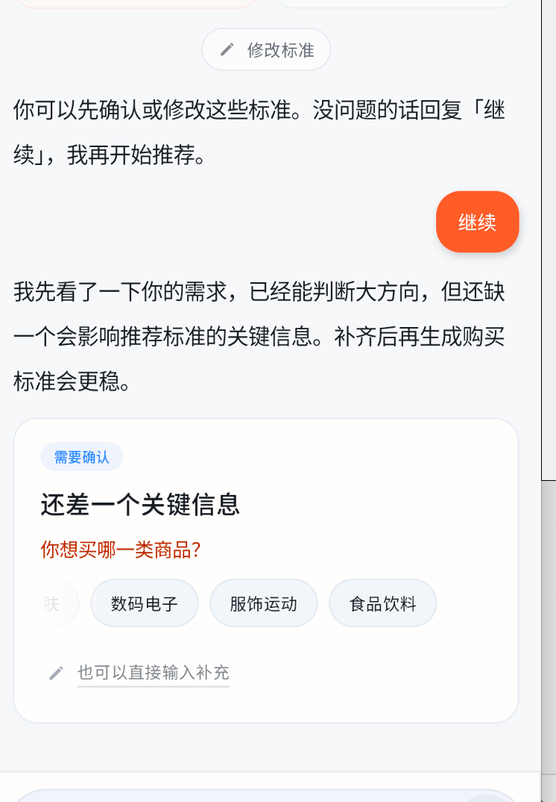

### 现象

用户已经说“CD 机”，系统生成了“数码电子 / CD 机 / 家庭影音播放”的标准卡，但继续后又问“你想买哪一类商品？”。这会让用户感觉系统前后矛盾：刚刚已经理解了，下一步又像没理解。

### 是否存在

确认存在。

### 代码证据

- `backend/src/config/domain_terms.py:18`：大品类关键词只覆盖护肤、手机、耳机、跑鞋、食品饮料等有限词。
- `backend/src/config/domain_terms.py:25`：`PRODUCT_TYPE_ALIASES` 没有 CD 机。
- `backend/src/runtime/stages/slot_checker.py:23`：如果当前 intent 没抽出 product_type，就会追问 product_type。
- `backend/src/runtime/pipeline.py:247`：缺槽位判断没有可靠使用上一轮标准卡里的 product_type。

### 根因

CD 机不是当前商品数据和领域词覆盖的品类。系统一方面可以通过 LLM 生成看似合理的标准卡，另一方面确定性 slot checker 和检索层又不认识它，导致继续后回到泛化追问。

### 修复建议

1. 对不在商品库覆盖范围内的 product_type，生成“暂不覆盖”说明，而不是进入标准确认流程。
2. 如果要支持 CD 机，需要补数据、domain terms、product type aliases、检索硬过滤和 demo 验收样例。
3. 如果上一轮标准卡已经明确 `product_type=CD机`，继续时不能丢失该槽位；应合并上一轮 criteria 后再判断是否可推荐。

### 验收用例

- 输入“CD机”时，如果商品库不支持，应明确提示“不覆盖 CD 机”，不要出现可继续推荐的标准卡。
- 如果未来支持 CD 机，回复“继续”后应进入候选商品，不应再问“你想买哪一类商品？”

## 建议修复优先级

### P0：先修流程正确性

1. 拆分 `_is_continue_command` 和 `_has_shopping_constraints`，确保首轮标准确认不会被普通购物词跳过。
2. 修复食品类 canonical category，统一 `食品生活 / 食品饮料`。
3. 合并上一轮 pending criteria 后再做 missing slot check，避免“继续后又追问”。
4. 调整后端主链路为分阶段状态机，确保 final_decision 在 SwipeDeck 用户反馈后再生成。

### P1：修导购体验

1. 增加品类化 slot readiness policy。
2. 对不支持品类输出明确边界提示。
3. 手机、数码、护肤等高差异品类增加关键追问规则。

### P2：修表达与 UI 认知负担

1. 标准卡标记字段来源：用户明确、系统推断、历史继承。
2. 主时间线推荐解释压缩为一句摘要。
3. 长解释转移到详情、证据或最终建议层。

## 回归测试建议

| 用例 | 预期 |
| --- | --- |
| “我想买个手机，平时拍照多” | 出标准卡并追问预算，不直接出商品 |
| “推荐一款手机” | 等待用户确认标准，回复“继续”后才出候选 |
| “推荐适合油皮的洗面奶” | 不应凭空出现硬预算；推断字段需标记 |
| “我是中性肌肤”作为澄清回答 | 合并到上一轮 pending slot，不重复问肤质 |
| “推荐无糖饮料” | 能召回食品类商品 |
| “推荐 CD 机” | 若数据不支持，明确说明暂不覆盖 |
| 候选商品出现后 | 主时间线只显示短摘要，不显示长段落 |
| product_card 后收到 final_decision | Android 端继续缓存，用户收敛后再展示 |
| SwipeDeck 用户反馈后回复“继续” | 后端读取当前 deck 反馈，再生成 final_decision |

## 当前已缓解项

- Android 前端已把 `final_decision` 缓存到 pending decision，避免候选商品刚出现就展示最终建议。
- Android 前端 Markdown 渲染已使用 Markwon，手写 Markdown 解析问题已缓解。
- 候选商品卡已在主时间线中优先展示，长文本问题主要剩余在后端文案长度和前端折叠策略。
